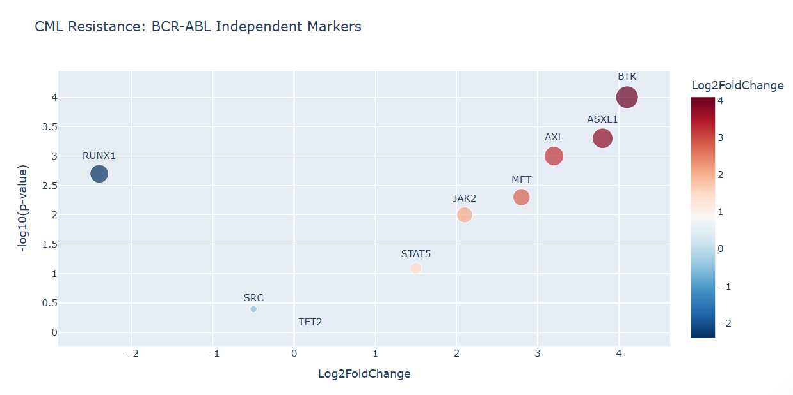

# CML-MultiOmics-Resistance-Analysis
**Identifying BCR-ABL Independent Resistance Mechanisms in Chronic Myeloid Leukemia (CML)**

## Project Overview
This project focuses on the identification of novel prognostic markers for Indian CML patients who exhibit resistance to TKI therapy through non-canonical pathways. Utilizing a multi-omics approach, this pipeline integrates NGS (Somatic Variant Calling) and Transcriptomic data.

## Analytical Results
The primary output of the integrated pipeline is the identification of significant markers via differential expression and mutational burden analysis.

*Figure 1: Volcano Plot showing significant upregulation of BCR-ABL independent markers (e.g., BTK, AXL, and ASXL1) in resistant cohorts.*

##  Technical Workflow (NGS Best Practices)
1. **Preprocessing:** QC using FastQC and trimming of raw NGS reads.
2. **Alignment:** BWA-MEM alignment to the h38 human reference genome.
3. **Variant Discovery:** GATK4 Mutect2 for somatic mutation detection.
4. **Integration:** Mapping genomic variants to transcriptomic expression profiles to isolate BCR-ABL independent mechanisms.

## Tech Stack
- **Languages:** Python, R
- **Bioinformatics:** GATK4, BWA, Samtools, DESeq2
- **Visualization:** Plotly, Streamlit
